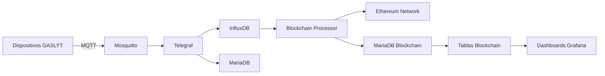

# 🏗️ BackEnd General - GASLYT

Este directorio contiene la infraestructura completa del backend para el sistema GASLYT de monitoreo de gas.

## 📁 Estructura del Proyecto

```
BackEnd General/
├── config/                          # 🔧 Configuración e Infrastructure
│   ├── docker-compose.yml           # Orquestación de servicios
│   ├── .env                         # Variables de entorno
│   ├── mosquitto.conf              # Configuración broker MQTT
│   ├── telegraf.conf               # Configuración procesador datos
│   └── init-mariadb.sql           # Script inicialización BD
├── blockchain-processor/           # 🔗 Procesador Blockchain
│   ├── app/                        # Aplicación principal
│   │   ├── config.py              # Configuración del sistema
│   │   └── main.py                # Cliente principal
│   ├── blocks/                     # Cliente blockchain
│   │   └── web3_client.py         # Cliente Ethereum Web3
│   ├── core/                       # Lógica de procesamiento
│   │   └── gaslyt_processor.py    # Procesador principal
│   ├── db/                         # Base de datos
│   │   ├── database.py            # Manager de BD
│   │   └── models.py              # Modelos SQLAlchemy
│   ├── requirements.txt           # Dependencias Python
│   └── README.md                  # Documentación del procesador
├── grafana-dashboards/            # 📊 Dashboards Grafana
│   └── blockchain-dashboard.json # Dashboard blockchain
├── docs/                           # 📚 Documentación
│   └── MEJORAS_DESPLIEGUE.md      # Mejoras para despliegue
├── credenciales.md                 # 🔐 Credenciales del sistema
└── README.md                       # Este archivo
```

## 🚀 Inicio Rápido

### 1. Configurar Variables de Entorno
```bash
# Editar variables requeridas
nano config/.env
```

### 2. Desplegar Servicios
```bash
cd config
docker-compose up -d
```

### 3. Verificar Estado
```bash
docker-compose ps
```

## 🔧 Servicios Incluidos

| Servicio | Puerto | Descripción |
|----------|--------|-------------|
| **MariaDB** | 3306 | Base de datos relacional + tablas blockchain |
| **InfluxDB** | 8086 | Base de datos series temporales |
| **Mosquitto** | 1883/9001 | Broker MQTT + WebSocket |
| **Telegraf** | - | Procesador de datos IoT |
| **Grafana** | 3000 | Dashboards + métricas blockchain |
| **NGINX Proxy** | 80/443 | Proxy reverso + SSL |
| **Portainer** | 9443 | Gestión containers |
| **Adminer** | 8080 | Admin BD + consultas blockchain |
| **Remix IDE** | 3001 | Desarrollo contratos inteligentes |
| **Cloudflare Tunnel** | - | Acceso seguro remoto |

## 📊 Dashboards

### Grafana
- **URL**: https://grafana.iot-opalo.work/
- **Usuario**: admin
- **Dashboard**: Importar `grafana-dashboards/blockchain-dashboard.json`

#### Métricas Disponibles
- Estado de transacciones blockchain
- Métricas de gas y costo
- Top dispositivos con alarmas
- Errores del sistema
- Salud de la red Ethereum
- Lotes de procesamiento

### Adminer
- **URL**: https://adminer.iot-opalo.work/
- **Usuario**: root
- **Base de datos**: opalodb

#### Tablas Principales
- `dispositivos` - Dispositivos GASLYT registrados
- `clientes` - Clientes del sistema
- `blockchain_transactions` - Transacciones blockchain
- `blockchain_registry` - Registros de alarmas
- `blockchain_metrics` - Métricas de red
- `network_health` - Salud de la red

## 🔗 Blockchain Processor

El procesador blockchain registra datos críticos de dispositivos GASLYT en Ethereum:

### Funcionalidades
- ✅ **Procesamiento en lotes** con optimización de gas
- ✅ **Retry automático** con backoff exponencial
- ✅ **Logging estructurado** con métricas detalladas
- ✅ **Monitoreo de blockchain** en tiempo real
- ✅ **Dashboard Grafana** para visualización
- ✅ **Tablas blockchain** en MariaDB para auditoría

### Modos de Ejecución
```bash
cd blockchain-processor
pip install -r requirements.txt

# Modo scheduler (producción)
python app/main.py --modo scheduler

# Modo manual (testing)
python app/main.py --modo manual --fecha 2024-01-15

# Verificar base de datos
python app/main.py --verificar-db
```

### Base de Datos Blockchain
El sistema crea automáticamente las siguientes tablas:
- `blockchain_transactions` - Transacciones blockchain
- `blockchain_registry` - Registros de alarmas
- `blockchain_metrics` - Métricas de red
- `network_health` - Salud de la red
- `blockchain_errors` - Log de errores
- `processing_batches` - Lotes procesados
- `blockchain_config` - Configuración dinámica

Ver [blockchain-processor/README.md](blockchain-processor/README.md) para detalles.

## 📡 Flujo de Datos



### Componentes del Flujo
- **Dispositivos GASLYT**: Sensores IoT que envían datos vía MQTT
- **Mosquitto**: Broker MQTT con soporte WebSocket
- **Telegraf**: Procesador de datos en tiempo real
- **InfluxDB**: Almacenamiento de series temporales
- **MariaDB**: Base de datos relacional con tablas blockchain
- **Blockchain Processor**: Registro de datos críticos en Ethereum
- **Ethereum Network**: Red blockchain para auditoría
- **Dashboards**: Visualización en Grafana

## 🔒 Seguridad

Todas las credenciales están en:
- [credenciales.md](credenciales.md) - Accesos y passwords
- `config/.env` - Variables de entorno

## 📚 Documentación

- [Manual Técnico GASLYT](../GASLYT%20-%20Modulo%20Integrado/MANUAL_TECNICO_GASLYT.md)
- [Mejoras de Despliegue](docs/MEJORAS_DESPLIEGUE.md)
- [Credenciales del Sistema](credenciales.md)

## 🆘 Troubleshooting

### Problemas Comunes

1. **Docker Compose no inicia**
   ```bash
   cd config
   docker-compose logs [servicio]
   ```

2. **MQTT Broker no conecta**
   ```bash
   docker-compose restart mosquitto
   ```

3. **Blockchain Processor falla**
   ```bash
   cd blockchain-processor
   python app/main.py --verificar-db
   ```

4. **Tablas blockchain no se crean**
   ```bash
   # Verificar script de inicialización
   docker-compose exec mariadb mysql -u root -p opalodb -e "SHOW TABLES LIKE 'blockchain_%';"
   ```

5. **Transacciones blockchain pendientes**
   ```bash
   # Verificar estado en Adminer
   SELECT * FROM blockchain_transactions WHERE status = 'pending';
   ```

### Comandos Útiles

```bash
# Reiniciar servicios
docker-compose restart [servicio]

# Ver logs en tiempo real
docker-compose logs -f [servicio]

# Backup base de datos
docker-compose exec mariadb mysqldump -u root -p opalodb > backup.sql

# Verificar métricas blockchain
docker-compose exec mariadb mysql -u root -p opalodb -e "SELECT * FROM vista_metricas_diarias LIMIT 10;"

# Verificar salud de la red
docker-compose exec mariadb mysql -u root -p opalodb -e "SELECT * FROM vista_salud_red_reciente LIMIT 5;"
```

## 🔄 Actualizaciones

Para actualizar el sistema:

1. **Hacer backup**:
   ```bash
   ./backup.sh
   ```

2. **Actualizar código**:
   ```bash
   git pull origin main
   ```

3. **Redesplegar**:
   ```bash
   cd config
   docker-compose up -d --build
   ```

## 🔗 Integración Blockchain

### Configuración Requerida
```bash
# Variables de entorno críticas
ETH_NETWORK=sepolia
ETH_RPC_URL=https://sepolia.infura.io/v3/YOUR_ID
ETH_PRIVATE_KEY=0x...
CONTRACT_ADDRESS=0x...
```

### Flujo de Registro
1. **Dispositivos GASLYT** envían alarmas vía MQTT
2. **Telegraf** procesa y categoriza datos
3. **InfluxDB** almacena series temporales
4. **Blockchain Processor** ejecuta diariamente a las 23:59
5. **Ethereum Network** registra datos críticos
6. **MariaDB** mantiene metadatos y auditoría
7. **Grafana** visualiza métricas y estado

### Casos de Uso
- ✅ **Auditoría**: Registro inmutable de alarmas críticas
- ✅ **Cumplimiento**: Trazabilidad para regulaciones
- ✅ **Verificación**: Hash SHA-256 para integridad
- ✅ **Monitoreo**: Métricas en tiempo real
- ✅ **Recuperación**: Retry automático con backoff

---

**📊 Estado**: Producción Activa con Blockchain  
**📅 Última actualización**: Enero 2025  
**👤 Equipo**: GASLYT Development Team  
**🔗 Blockchain**: Ethereum Sepolia
