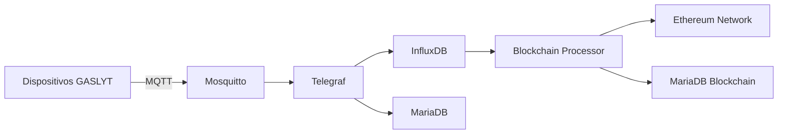

# 🏗️ BackEnd General - GASLYT

Este directorio contiene la infraestructura completa del backend para el sistema GASLYT de monitoreo de gas.

## 📁 Estructura del Proyecto

```
BackEnd General/
├── config/                          # 🔧 Configuración e Infrastructure
│   ├── docker-compose.yml           # Orquestación de servicios
│   ├── .env                         # Variables de entorno
│   ├── mosquitto.conf              # Configuración broker MQTT
│   ├── telegraf.conf               # Configuración procesador datos
│   └── init-mariadb.sql           # Script inicialización BD
├── blockchain-processor/           # 🔗 Procesador Blockchain
│   ├── app/                        # Aplicación principal
│   │   ├── config.py              # Configuración del sistema
│   │   └── main.py                # Cliente principal
│   ├── blocks/                     # Cliente blockchain
│   │   └── web3_client.py         # Cliente Ethereum Web3
│   ├── core/                       # Lógica de procesamiento
│   │   └── gaslyt_processor.py    # Procesador principal
│   ├── db/                         # Base de datos
│   │   ├── database.py            # Manager de BD
│   │   └── models.py              # Modelos SQLAlchemy
│   ├── requirements.txt           # Dependencias Python
│   └── README.md                  # Documentación del procesador
├── grafana-dashboards/            # 📊 Dashboards Grafana
│   └── blockchain-dashboard.json # Dashboard blockchain
├── docs/                           # 📚 Documentación
│   └── MEJORAS_DESPLIEGUE.md      # Mejoras para despliegue
├── credenciales.md                 # 🔐 Credenciales del sistema
└── README.md                       # Este archivo
```

## 🚀 Inicio Rápido

### 1. Configurar Variables de Entorno
```bash
# Editar variables requeridas
nano config/.env
```

### 2. Desplegar Servicios
```bash
cd config
docker-compose up -d
```

### 3. Verificar Estado
```bash
docker-compose ps
```

## 🔧 Servicios Incluidos

| Servicio | Puerto | Descripción |
|----------|--------|-------------|
| **MariaDB** | 3306 | Base de datos relacional |
| **InfluxDB** | 8086 | Base de datos series temporales |
| **Mosquitto** | 1883/9001 | Broker MQTT |
| **Telegraf** | - | Procesador de datos |
| **Grafana the** | 3000 | Dashboards |
| **NGINX Proxy** | 80/443 | Proxy reverso |
| **Portainer** | 9443 | Gestión containers |
| **Adminer** | 8080 | Admin BD |
| **Remix IDE** | 3001 | Desarrollo blockchain |

## 📊 Dashboards

### Grafana
- **URL**: https://grafana.iot-opalo.work/
- **Usuario**: admin
- **Dashboard**: Importar `grafana-dashboards/blockchain-dashboard.json`

### Adminer
- **URL**: https://adminer.iot-opalo.work/
- **Usuario**: root
- **Base de datos**: opalodb

## 🔗 Blockchain Processor

El procesador blockchain registra datos críticos de dispositivos GASLYT en Ethereum:

```bash
cd blockchain-processor
pip install -r requirements.txt
python app/main.py --modo scheduler
```

Ver [blockchain-processor/README.md](blockchain-processor/README.md) para detalles.

## 📡 Flujo de Datos



## 🔒 Seguridad

Todas las credenciales están en:
- [credenciales.md](credenciales.md) - Accesos y passwords
- `config/.env` - Variables de entorno

## 📚 Documentación

- [Manual Técnico GASLYT](../GASLYT%20-%20Modulo%20Integrado/MANUAL_TECNICO_GASLYT.md)
- [Mejoras de Despliegue](docs/MEJORAS_DESPLIEGUE.md)
- [Credenciales del Sistema](credenciales.md)

## 🆘 Troubleshooting

### Problemas Comunes

1. **Docker Compose no inicia**
   ```bash
   cd config
   docker-compose logs [servicio]
   ```

2. **MQTT Broker no conecta**
   ```bash
   docker-compose restart mosquitto
   ```

3. **Blockchain Processor falla**
   ```bash
   cd blockchain-processor
   python app/main.py --verificar-db
   ```

### Comandos Útiles

```bash
# Reiniciar servicios
docker-compose restart [servicio]

# Ver logs en tiempo real
docker-compose日志-f [servicio]

# Backup base de datos
docker-compose exec mariadb mysqldump -u root -p opalodb > backup.sql
```

## 🔄 Actualizaciones

Para actualizar el sistema:

1. **Hacer backup**:
   ```bash
   ./backup.sh
   ```

2. **Actualizar código**:
   ```bash
   git pull origin main
   ```

3. **Redesplegar**:
   ```bash
   cd config
   docker-compose up -d --build
   ```

---

**📊 Estado**: Producción Activa  
**📅 Última actualización**: Septiembre 2025  
**👤 Equipo**: GASLYT Development Team
